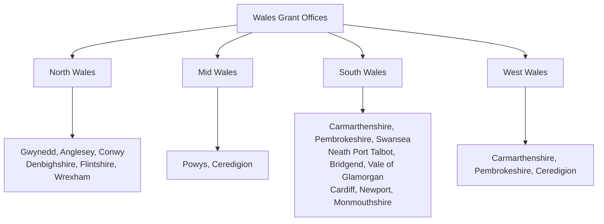

# Sheep Farming in Wales: Everything You Need to Know (+ Map of Local Grants)

Wales is synonymous with sheep farming. With over 10 million sheep—roughly a third of the UK’s total flock—sheep are the backbone of Welsh agriculture. The rugged landscape, temperate climate, and rich pastoral traditions make Wales ideal for raising hardy, free‑ranging flocks.

Whether you’re a new entrant looking to start a flock or an established farmer exploring Welsh opportunities, this guide covers the essentials: Welsh climate and terrain, best sheep breeds for Wales, current grant schemes, common challenges and solutions, key contacts and resources, and realistic cost estimates.

---

## 1. Welsh Climate and Terrain for Sheep

### Climate
Wales experiences a **temperate maritime climate** with mild, wet winters and cool, often damp summers. Annual rainfall ranges from about 850 mm in the east to over 3,000 mm in the Snowdonia mountains. The relatively mild temperatures (rarely below –5 °C in winter) allow sheep to stay outdoors year‑round, though upland flocks may need shelter during harsh weather.

**Key climate considerations:**
- **Winter wetness** – persistent rain can lead to foot rot and parasitic challenges.
- **Spring variability** – late frosts and cold snaps can affect lambing survival.
- **Summer grass growth** – ample rainfall promotes lush pasture, but wet conditions can also favour parasites.

### Terrain
Wales is dominated by **uplands, mountains, and rolling hills**, with only about 20% of land classified as lowland. This topography shapes sheep‑farming practices:

- **Upland areas** (e.g., Snowdonia, Cambrian Mountains) – extensive grazing, hardy breeds, lower stocking densities.
- **Hill and marginal land** – suited for pure Welsh Mountain flocks; requires careful flock management.
- **Lowland pastures** (valleys, coastal plains) – higher stocking rates, more intensive systems, often used for finishing lambs.

The varied terrain means **fencing, shepherding, and gathering** are more labour‑intensive than in flat regions. Mobile handling systems and well‑trained sheepdogs are essential.

---

## 2. Best Sheep Breeds for Wales

Welsh sheep breeds have evolved to thrive in local conditions. The following are well‑suited to Welsh farming systems:

| Breed | Key Characteristics | Best For |
|-------|---------------------|----------|
| **Welsh Mountain** (various types) | Small, hardy, excellent foragers, good mothers, lambing percentages 130–180%. White, Badger Face (Torddu/Torwen), Balwen, Black Welsh Mountain varieties. | Upland and hill farming; foundation stock for cross‑breeding. |
| **Beulah Speckled Face** | Medium‑sized, speckled face and legs, prolific, good milking ability. | Hill and upland areas; produces quality lambs for finishing. |
| **Welsh Halfbred** (Welsh Mountain × Border Leicester) | Larger, more growth‑oriented, good maternal traits. | Lowland and improved pasture; often used as a cross‑bred ewe for terminal sires. |
| **Lleyn** | Prolific, easy‑care, good milkers, suitable for lowland and upland. | Grass‑based systems; popular for its docile temperament and high lamb output. |
| **South Wales Mountain** | Larger than standard Welsh Mountain, white with tan markings, higher fleece weight. | Marginal and upland areas where more size is needed. |
| **Suffolk** (terminal sire) | Fast‑growing, excellent carcass conformation. | Crossing with Welsh ewes to produce prime lambs for market. |
| **Texel** (terminal sire) | High meat yield, good muscling. | Terminal crossing for premium lamb production. |

**Recommendation:** For purebred upland flocks, choose Welsh Mountain or Beulah Speckled Face. For lowland finishing, consider Welsh Halfbred or Lleyn ewes crossed with Suffolk/Texel rams.

---

## 3. Local Grant Schemes (Glastir, Welsh Government Support)

Since the UK’s exit from the EU, Welsh agricultural support has shifted from the Common Agricultural Policy (CAP) to Welsh‑designed schemes. The main programmes are:

### Sustainable Farming Scheme (SFS) – *replacing Glastir from 2025*
The SFS is the cornerstone of future support. It will pay farmers for delivering **environmental outcomes** alongside food production. Likely components:
- **Universal Actions** – all farmers must meet baseline requirements (e.g., soil management, habitat retention).
- **Optional Actions** – additional payments for specific environmental enhancements (woodland creation, peatland restoration, etc.).
- **Collaborative Actions** – extra support for landscape‑scale projects.

Farmers will need to produce a **Sustainable Farm Plan** and record actions via RPW Online.

### Farming Connect
A free advisory service providing **technical advice, training, and knowledge transfer**. Key offerings:
- One‑to‑one farm reviews.
- Mentoring for new entrants.
- Workshops on topics like grassland management, animal health, and business planning.
- Access to innovation funds and demonstration farms.

### Farming Investment Fund (FIF)
Grants for **capital investments** that improve productivity, environmental performance, or animal welfare. Includes:
- **Equipment and Technology** – up to 40% of costs (minimum £3,000, maximum £25,000).
- **Water Management** – infrastructure for efficient water use.
- **Animal Health and Welfare** – handling systems, housing improvements.

### Basic Payment Scheme (BPS) Transition
BPS payments are being phased out (reducing each year) and will be fully replaced by the SFS by **2027**. Farmers should plan for decreasing direct payments and focus on diversifying income.

### Other Support
- **Rural Development Programme (RDP)** – historic scheme (now closed) that funded Glastir; some legacy contracts still active.
- **Woodland Creation Grants** – for planting trees on agricultural land (via Welsh Government Woodland Estate).
- **Brexit Adjustment Reserve** – limited‑time funds to help businesses adapt to post‑EU trade realities.

**Always check the latest guidance on [RPW Online](https://gov.wales/rural-payments-wales) or through Farming Connect.**

---

## 4. Common Challenges and Solutions

| Challenge | Solution |
|-----------|----------|
| **Foot rot & parasites** | Regular foot trimming, vaccination, strategic dosing, pasture rotation, use of resilient breeds. |
| **Poor lamb survival** | Provide shelter during lambing, ensure colostrum intake, use lambing sheds in harsh weather, select for easy‑care traits. |
| **Low profitability** | Diversify income (e.g., agri‑tourism, wool products), join producer groups, target premium markets (e.g., Welsh Lamb PGI), maximise grant uptake. |
| **Labour shortages** | Invest in labour‑saving technology (auto‑feeders, EID readers), use sheepdogs effectively, consider contract shearing services. |
| **Weather extremes** | Maintain ample forage reserves, ensure adequate drainage, provide field shelters, plan for early/late lambing to avoid worst weather. |
| **Market volatility** | Forward‑contract lamb sales, develop direct‑to‑consumer channels (farm shop, online sales), join a marketing cooperative. |
| **Regulatory changes** | Attend Farming Connect events, subscribe to NFU Cymru updates, use RPW Online alerts, seek professional advice. |

---

## 5. Contacts and Resources

| Organisation | Contact | Purpose |
|--------------|---------|----------|
| **Rural Payments Wales (RPW)** | [RPW Online](https://gov.wales/rural-payments-wales) 0300 062 5000 | Single point for grant applications, payments, and scheme queries. |
| **Farming Connect** | [Farming Connect](https://businesswales.gov.wales/farmingconnect) 08456 000 813 | Free advice, training, and support for Welsh farmers. |
| **NFU Cymru** | [NFU Cymru](https://www.nfucymru.org.uk) 01982 554 200 | Representation, policy updates, legal and business advice. |
| **Welsh Government Agriculture Department** | [Agriculture](https://gov.wales/agriculture) 0300 060 4400 | Policy, regulation, and strategic guidance. |
| **Hybu Cig Cymru (HCC)** | [HCC](https://hccmpw.org.uk) 01970 625050 | Promotion and marketing of Welsh red meat (including Welsh Lamb PGI). |
| **National Sheep Association (NSA) Welsh Region** | [NSA Wales](https://nationalsheep.org.uk/wales) 07884 188 544 | Technical advice, events, and networking for sheep producers. |
| **Local Veterinary Practice** | Find via [RCVS](https://findavet.rcvs.org.uk) | Routine health planning, emergency care, and biosecurity advice. |

**Map of Local Grant Offices** (approximate locations):

Check the [Welsh Government’s regional office list](https://gov.wales/contact-us-farming-and-countryside) for the nearest office.

---

## 6. Cost Estimates (Starting a Small Flock)

Costs vary widely depending on scale, land tenure, and system. Below are *rough estimates* for a **100‑ewe lowland flock** (based on 2026 figures).

| Item | Estimated Cost | Notes |
|------|----------------|-------|
| **Land** (rental, per hectare/year) | £100–£250/ha | Upland cheaper, lowland more expensive. |
| **Ewes** (100 head @ £120–£180 each) | £12,000–£18,000 | Prices depend on breed, age, quality. |
| **Rams** (2 @ £800–£1,500 each) | £1,600–£3,000 | Terminal sire breeds cost more. |
| **Fencing** (per 100 m) | £500–£1,000 | Electric or stock fencing; hills need more. |
| **Handling system** (basic) | £2,500–£5,000 | Race, pen, weigh crate, EID reader. |
| **Feed** (winter, per ewe) | £20–£40 | Hay, silage, concentrate. |
| **Vet & medicine** (annual) | £800–£1,500 | Vaccinations, parasite control, emergencies. |
| **Labour** (part‑time shepherd) | £5,000–£10,000/yr | Owner‑operator may not draw salary initially. |
| **Insurance & admin** | £1,000–£2,000/yr | Public liability, livestock insurance, accounting. |
| **Miscellaneous** (tags, dipping, shearing) | £500–£1,000/yr | |

**Total first‑year investment** (excluding land purchase): **£25,000–£45,000**.

**Revenue assumptions** (100 ewes, lambing percentage 150%, 90% saleable):
- Lambs sold @ £80–£100 each (liveweight): **£10,800–£13,500**.
- Wool income (per ewe): £2–£5 → **£200–£500**.
- **Potential gross output**: **£11,000–£14,000** in year one.

**Break‑even** usually takes 3–5 years, depending on grant support, market prices, and management efficiency.

---

## Conclusion

Sheep farming in Wales is both a tradition and a modern business. The landscape demands hardy breeds and resilient management, but Welsh Government schemes like the **Sustainable Farming Scheme** and **Farming Connect** provide a safety net for new and existing flocks.

**Key takeaways:**
1. **Choose the right breed** for your terrain – Welsh Mountain for hills, cross‑breds for lowland finishing.
2. **Engage early with grant programmes** – SFS will be the main income support from 2025.
3. **Plan for challenges** – foot rot, parasites, and weather are the biggest risks.
4. **Use free advice** – Farming Connect and NFU Cymru are invaluable.
5. **Start small, scale wisely** – a 100‑ewe flock is a realistic entry point.

Welsh lamb carries a proud **Protected Geographical Indication (PGI)** status, and global demand for sustainably produced meat is growing. With careful planning and the right support, sheep farming in Wales can be a rewarding and viable enterprise.

---

*This guide is intended as a general overview. Always consult official sources (RPW Online, Farming Connect) for the most up‑to‑date scheme details and seek professional advice before making financial commitments.*

*Last updated: February 2026*